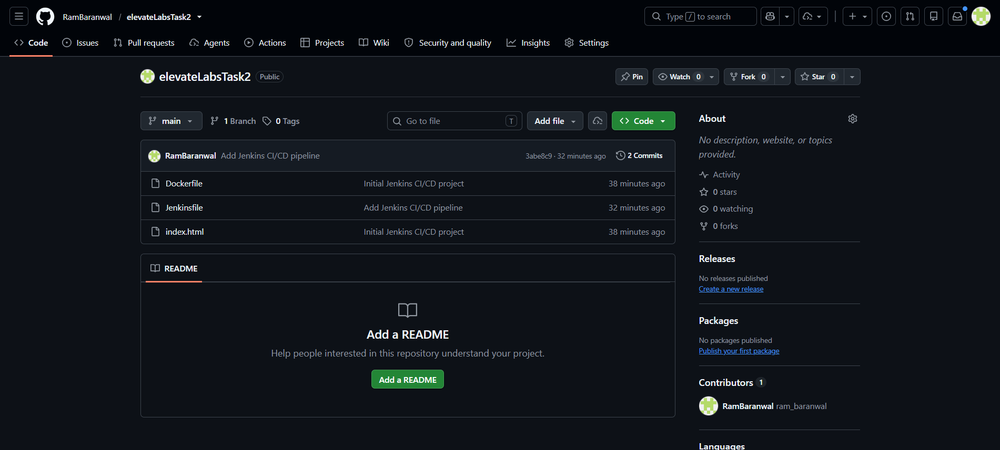
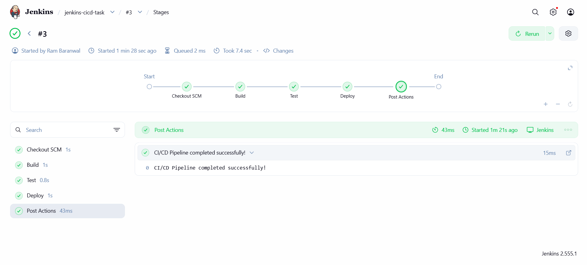
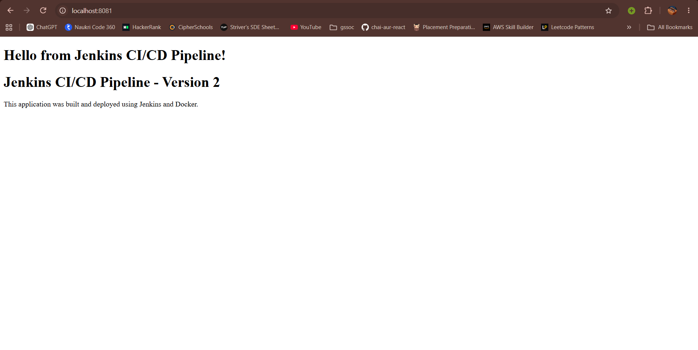

# Jenkins CI/CD Pipeline

## Objective

Create a simple Jenkins CI/CD pipeline to automatically build, test,
and deploy an application using Docker.

## Technologies Used

- Jenkins
- Docker
- Git
- GitHub
- Nginx

## Pipeline Stages

### 1. Build

Jenkins builds the Docker image using the Dockerfile.

### 2. Test

Jenkins runs the Docker image and verifies the Nginx configuration.

### 3. Deploy

Jenkins stops the previous container and starts a new Docker container.

## Pipeline Flow

Git Push
↓
Jenkins
↓
Build
↓
Test
↓
Docker Deploy

## Application

The application is a simple HTML page served using Nginx.

## Deployment

The application is available at:

http://localhost:8081

## Files

- `index.html` - Application webpage
- `Dockerfile` - Docker image configuration
- `Jenkinsfile` - Jenkins CI/CD pipeline
- `README.md` - Project documentation

